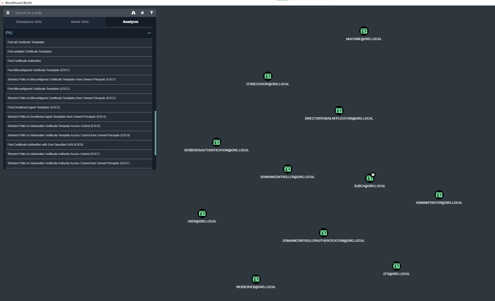
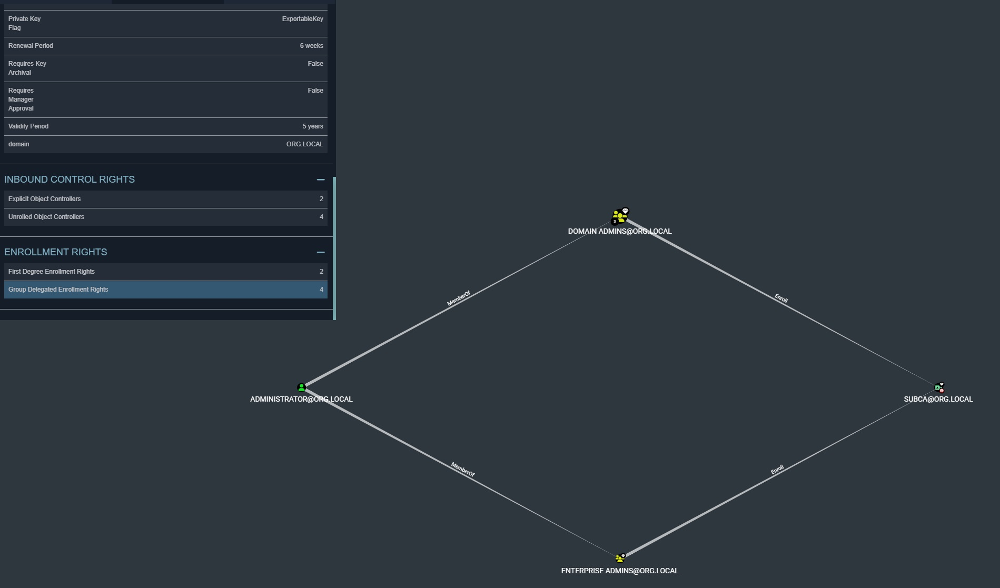
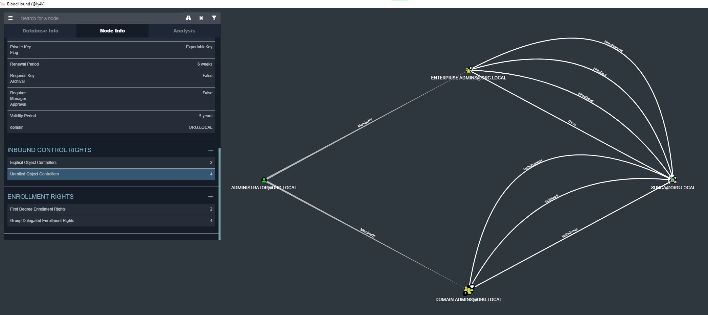
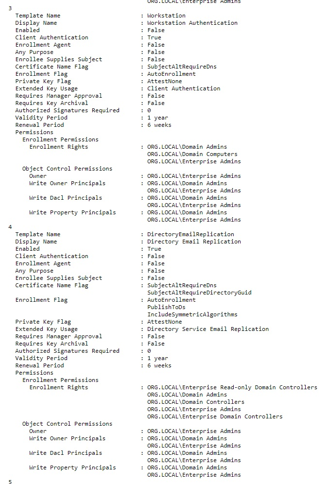
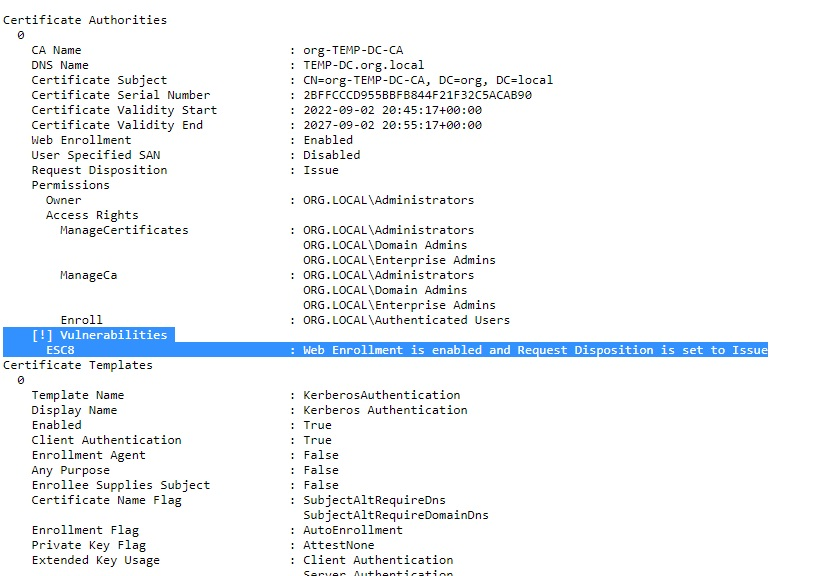

Прежде чем что-то делать, пропишем себе контроллер атакуемого домена в /etc/resolv.conf в качестве дополнительного DNS-сервера и помним об этом.

Certipy очень функциональная тулза для анализа безопасности AD CS, можно полистать перечень возможностей тут https://github.com/ly4k/Certipy.  
Среди прочего Certipy позволяет собрать информацию о конфигурации центров сертификации и шаблонов AD CS, в том числе в формате для BloodHound. Дополненная версия https://github.com/ly4k/BloodHound умеет анализировать вектора атак по этим данным.  
```
# certipy find -u user@org.local -p '6GYToz&UOjAt5GH' -dc-ip 10.128.0.8
Certipy v4.0.0 - by Oliver Lyak (ly4k)

[*] Finding certificate templates
[*] Found 33 certificate templates
[*] Finding certificate authorities
[*] Found 1 certificate authority
[*] Found 11 enabled certificate templates
[*] Trying to get CA configuration for 'org-TEMP-DC-CA' via CSRA
[!] Got error while trying to get CA configuration for 'org-TEMP-DC-CA' via CSRA: CASessionError: code: 0x80070005 - E_ACCESSDENIED - General access denied error.
[*] Trying to get CA configuration for 'org-TEMP-DC-CA' via RRP
[!] Failed to connect to remote registry. Service should be starting now. Trying again...
[*] Got CA configuration for 'org-TEMP-DC-CA'
[*] Saved BloodHound data to '20220908184537_Certipy.zip'. Drag and drop the file into the BloodHound GUI from @ly4k
[*] Saved text output to '20220908184537_Certipy.txt'
[*] Saved JSON output to '20220908184537_Certipy.json'
```

Закидываем полученный zip в интерфейс BloodHound. Есть ряд предзаготовленных запросов для просмотра имеющихся центров сертификации, шаблонов и проверки наличия уязвимостей AD CS:  


Ознакомиться с основными векторами атак можно в статьях https://posts.specterops.io/certified-pre-owned-d95910965cd2 и https://research.ifcr.dk/certipy-2-0-bloodhound-new-escalations-shadow-credentials-golden-certificates-and-more-34d1c26f0dc6
Certifried, ESC9 и ESC10 - очень хорошие и актуальные техники: https://research.ifcr.dk/certifried-active-directory-domain-privilege-escalation-cve-2022-26923-9e098fe298f4, https://research.ifcr.dk/certipy-4-0-esc9-esc10-bloodhound-gui-new-authentication-and-request-methods-and-more-7237d88061f7


В BloodHound можно посмотреть перечень субъектов, которым разрешено получение сертификата по заданному шаблону:  


И субъектов с правами доступа к изменению свойств шаблона:  


Кроме этого Certipy генерит текстовый файл, в котором удобно просматривать свойства шаблонов и приводятся отметки о наличии уязвимостей ESCX, здесь же мы можем взять имя центра сертификации и DNS-имя хоста, где он размещен, они могут существенно отличаться (а также можно в интерфейсе BloodHound при просмотре свойств Certification Authority):  


На нашем стенде без какой-либо конфигурации после установки службы AD CS с веб-сервисов выдачи сертификатов нет уязвимых шаблонов с мисконфигами. Потенциально на стенде может присутствовать путь через компрометацию хоста цетра сертификации (в зависимости от сгенеренных BadBlood прав), но это контроллер домена, так что такой вектор в данном случае избыточен.  
Но присутсвует ESC8 - отсутствие защиты от NTLM-Relay на веб-сервисе выдачи сертификатов.  

